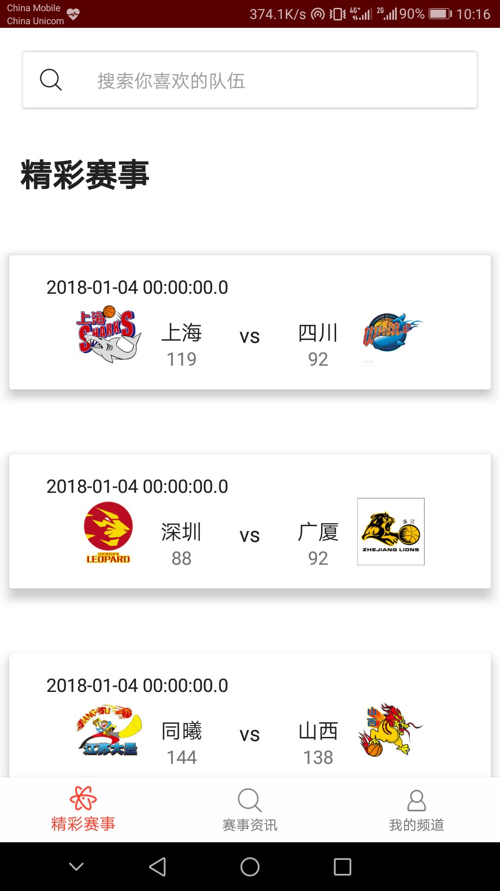

# cs2015.ibasketball.Android
## 介绍

这个项目是本小组在软件工程专业课上的一周实习周完成的Android客户端。

预览页面:





## 使用

使用Android Studio导入Gradle Project应该就能用了。:smile:

数据库需要修改到自己的云服务器上，建表语句如下：


## 数据库设计

```mysql
create database BBBS;
use BBBS;
```

```mysql
drop database BBBS;
```

```mysql
create table userinfo
(
   user_id             		int AUTO_INCREMENT, 
   user_name         	  	varchar(30) not null,	 
   user_password      		varchar(20) not null DEFAULT '123456',	  
   user_addr				varchar(20),
   user_email				varchar(20), 
   user_tel					char(11),
   user_avatar  			text,
   user_truname				varchar(20),
   user_intro				text,
   primary key (user_id)
)character set = utf8;

insert into userinfo(user_name,user_password) values('a', '123456');
insert  into `userinfo`(`user_name`,`user_password`,`user_addr`,`user_email`,`user_tel`,`user_avatar`,`user_truname`,`user_intro`) values ('chris','123456','address','email','13145453456','http://news.cn','周杰伦','我是歌手第五季导师\r\n'),('lxb','123456','address2','email2','13223435456','陈奕迅唱的是真好\r\n','陈奕迅',NULL);

```


```mysql
create table managerinfo
(
	mag_id					int AUTO_INCREMENT, 
    mag_name				varchar(30),
	mag_password			varchar(20) not null DEFAULT '123456',
	mag_truname				varchar(20) not null,
	primary key (mag_id)
)character set = utf8;

insert  into `managerinfo`(`mag_name`,`mag_password`,`mag_truname`) values ('admin','123456','chris'),('admin2','123456','Young');
```

```mysql
create table newsinfo
(
	news_id					int AUTO_INCREMENT,
	mag_id					int,
	news_title				text not null,
	news_content			text,
	news_time				datetime default CURRENT_TIMESTAMP,
	news_pic				text,
	news_count				int,
	foreign key (mag_id) references ManagerInfo (mag_id),
	primary key (news_id)
)character set = utf8;
DROP TRIGGER `ni_insert_current_time`;
DELIMITER //
CREATE TRIGGER `ni_insert_current_time` BEFORE INSERT ON `NewsInfo` FOR EACH ROW
BEGIN
    SET NEW.news_time = NOW();
END//
DELIMITER ;
```

```mysql

create table gameinfo
(
	game_id					int AUTO_INCREMENT,
	game_time				datetime		default CURRENT_TIMESTAMP,
	game_location			text 			not null,
	game_team1				varchar(20)		not null,
	game_team2				varchar(20)		not null,
	game_result				text,
	primary key (game_id)
)character set = utf8;
```

```mysql

create table teaminfo
(
	team_id				int AUTO_INCREMENT,
	team_name			varchar(20)		not null,
	team_time			int, # 球队建立时间，因为大部分只有年份，改成int
	team_coachers		text,
	team_players		text,
	team_logo 			text,
	team_honors			text,
	primary key (team_id)
)character set = utf8;

insert into teaminfo(team_name, team_time) values('小队','1998-1-1');
```

```mysql
# 联系的关系模式
create table usercollectnews
(
	ucn_id					int AUTO_INCREMENT,
	user_id					int default null,
	news_id					int default null,
	collection_time			datetime default CURRENT_TIMESTAMP,
	foreign key (user_id) references UserInfo (user_id),
	foreign key (news_id) references NewsInfo (news_id),
	primary key (ucn_id)	
)character set = utf8;

DROP TRIGGER `ci_insert_current_time`;
DROP TRIGGER `ci_update_current_time`;
DELIMITER //
CREATE TRIGGER `ci_insert_current_time` BEFORE INSERT ON `usercollectnews` FOR EACH ROW
BEGIN
    SET NEW.collection_time = NOW();
END//
DELIMITER ;
DELIMITER //
CREATE TRIGGER `ci_update_current_time` BEFORE UPDATE ON `usercollectnews` FOR EACH ROW
BEGIN
    SET NEW.collection_time = NOW();
END//
DELIMITER ;
```

```mysql
# 联系的关系模式
create table usermessagenews
(
	umn_id			int AUTO_INCREMENT,
	user_id				int default null,
	news_id				int default null,
	message_time		datetime default CURRENT_TIMESTAMP,
	message_content		text,
	foreign key (user_id) references UserInfo (user_id),
	foreign key (news_id) references NewsInfo (news_id),
	primary key (umn_id)	
)character set = utf8;

DROP TRIGGER `mi_insert_current_time`;
DROP TRIGGER `mi_update_current_time`;
DELIMITER //
CREATE TRIGGER `mi_insert_current_time` BEFORE INSERT ON `usermessagenews` FOR EACH ROW
BEGIN
    SET NEW.message_time = NOW();
END//
DELIMITER ;
DELIMITER //
CREATE TRIGGER `mi_update_current_time` BEFORE UPDATE ON `UserMessageNews` FOR EACH ROW
BEGIN
    SET NEW.message_time = NOW();
END//
DELIMITER ;
```

```mysql

create table scoreinfo
(
	score_id			int AUTO_INCREMENT,
	score_ranking		int not null,
	team_id				int default null,
	score_wins			int,
	score_loses			int,
	score_ppg			float,
	score_plp			float,
	score_tg			int,
	primary key (score_id),
 	foreign key (team_id) references teaminfo (team_id)
)character set = utf8;
```

```mysql

create table announceinfo
(
	announce_id			int AUTO_INCREMENT,
	user_id				int default null,
	announce_title		text not null,
	announce_content	text,
	announce_time		datetime default CURRENT_TIMESTAMP,
	foreign key (user_id) references UserInfo (user_id),
	primary key (announce_id)	
)character set = utf8;

DROP TRIGGER `ai_insert_current_time`;
DROP TRIGGER `ai_update_current_time`;
DELIMITER //
CREATE TRIGGER `ai_insert_current_time` BEFORE INSERT ON `announceinfo` FOR EACH ROW
BEGIN
    SET NEW.announce_time = NOW();
END//
DELIMITER ;
DELIMITER //
CREATE TRIGGER `ai_update_current_time` BEFORE UPDATE ON `announceinfo` FOR EACH ROW
BEGIN
    SET NEW.announce_time = NOW();
END//
DELIMITER ;
```
